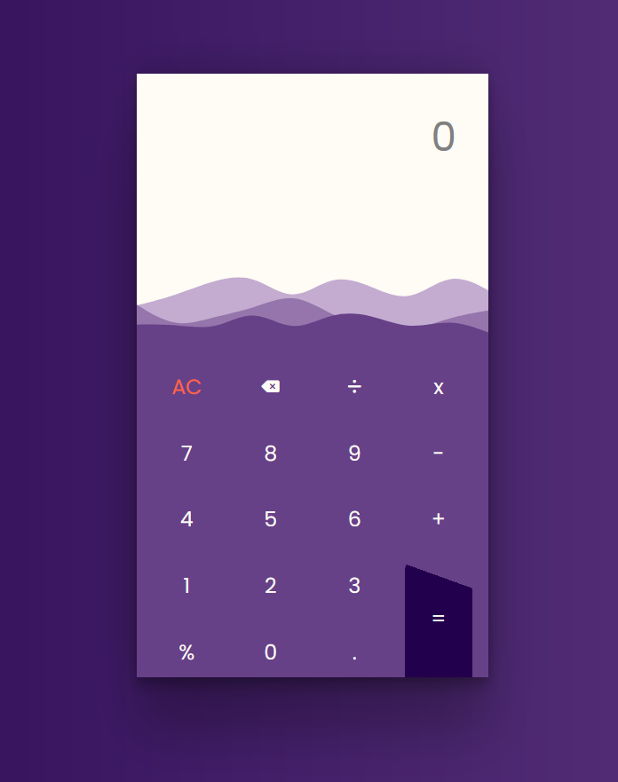

# Simple Calculator in HTML, CSS and JS
This repository contains the code for a simple calculator created using HTML, CSS, and JavaScript. The calculator has a sleek and modern design, ensuring not only functionality but also an aesthetically pleasing user experience.

## Features
1. Basic arithmetic operations: addition, subtraction, multiplication, and division.
2. AC button to clear the current input.
3. Responsive design that looks good on both desktop and mobile devices.

## Preview

